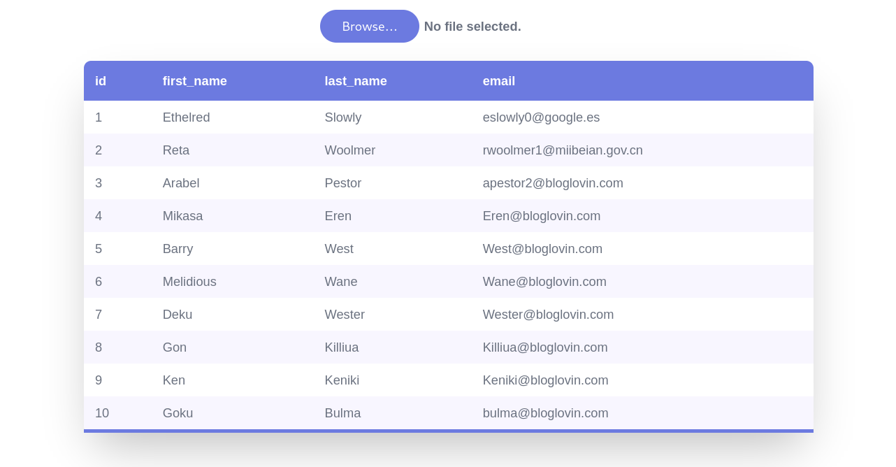

<!-- Links -->
[](https://github.com/ShubhdeepRose/jtable/stargazers)
[](https://github.com/ShubhdeepRose/jtable/issues)


[](https://linkedin.com/in/shubhdeep404)

# ⭐ JTable 

JTable, a web-based tool to view JSON content in a table.

## Demo

**Link** : https://shubhdeeprose.github.io/jtable




## Required JSON format

To run the application, pass an array of JSON objects.

```bash
[
    {
        "id": 1,
        "first_name": "Ethelred",
        "last_name": "Slowly",
        "email": "eslowly0@google.es"
    }
]
```

## Features

- JSON to TABLE Convert
- JSON File Upload & Parse Functionality
- File Extension Validation 


## Lessons Learned

This is my first step in the journey towards a career in full-stack web development.

* Tailwind CSS
* React JS
* React Hooks
* React Error Handling & Logging
* Setting up Tailwind CSS in a Create React App project
* How to Publish the React application on GitHub Pages

## Limitations

* Do not support dataset with JSON nested objects
* Do not support Large JSON datasets

## Tech Stack

![HTML][html-shield]

![CSS][css-shield] 

![JS][js-shield]


[html-shield]: https://img.shields.io/badge/HTML5-E34F26?style=for-the-badge&logo=html5&logoColor=white
[css-shield]:https://img.shields.io/badge/Tailwind_CSS-38B2AC?style=for-the-badge&logo=tailwind-css&logoColor=white
[js-shield]:https://img.shields.io/badge/React-20232A?style=for-the-badge&logo=react&logoColor=61DAFB
